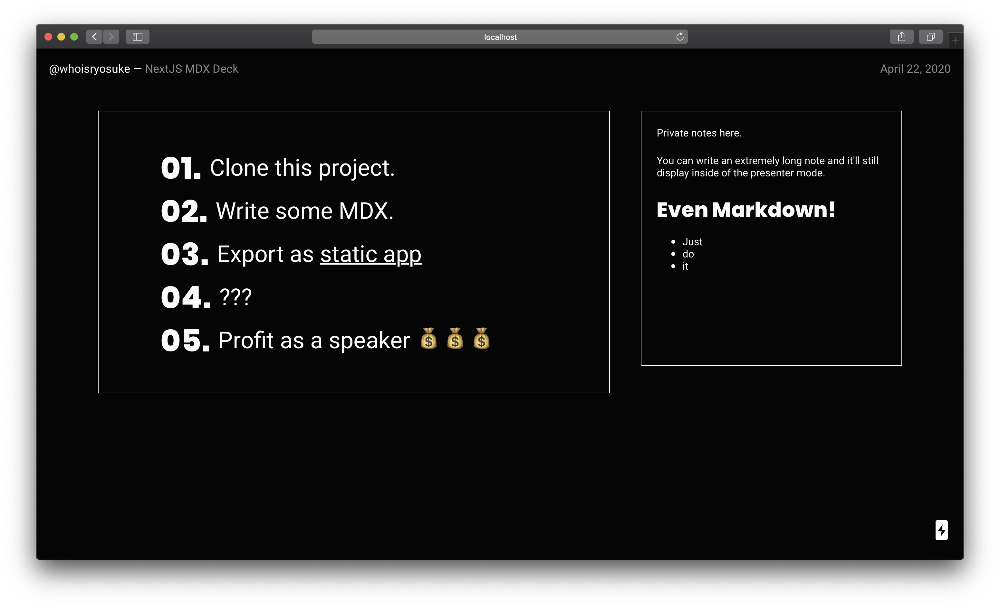

# Next MDX Deck

Create presentation decks using MDX, React, and [Next.js](https://nextjs.org/).

## Features

- 📽 React-based Slideshow
- ✍️ Write using Markdown, React components, even HTML!
- 🎨 Themeable with CSS vars or Styled Components
- 👉 Swipe to change slides
- ♻️ Sync slides between browser tabs
- 👨‍💻 Presentation Mode
- 📝 Speaker Notes

## Getting Started

1. Install dependencies: `npm i` or `yarn`
2. Run the dev server: `npm run dev` or `yarn dev`
3. [Go to slideshow](http://localhost:3000/)!

When you're done, run `npm run build && npm run export` or `yarn build && yarn export` will create a static app you can deploy anywhere (or use locally). See below for more details.

### Deploying

This project is easy to build locally or using a host with build services (like Netlify or Now).

1. ⚙️ Run the build process: `yarn export`
1. 🚀 Upload the static contents of `out` folder to host/CDN (or run the `out/index.html` locally)

## Presentation Mode

Presentation mode allows you to view the current slide alongside any **"speaker notes"** included inside the slide.

- Press `ALT/OPT + P` to toggle presentation mode on and off.
- You can also add the `mode` query parameter to the URL (e.g. `http://localhost:3000/slides/1?mode=presentation`).

The most common way to use presentation mode:

1. Open two browser tabs with any slide page.
2. Activate presentation mode in one tab.
3. Navigate through slides - they'll be synced in both tabs!

This way you can view your presentation on one monitor, while displaying the slides on another screen. Or if you're livestreaming, you can capture the slideshow window in software like OBS, and view the presentation window privately.

> Note that syncing between tabs is achieved using `localStorage`. If you want to use an "Incognito" browser, make sure both tabs are "incognito" or they won't sync.

### References

- [Next-MDX-Deck](https://github.com/whoisryosuke/next-mdx-deck)
- [Next.js Documentation](https://nextjs.org/docs)
