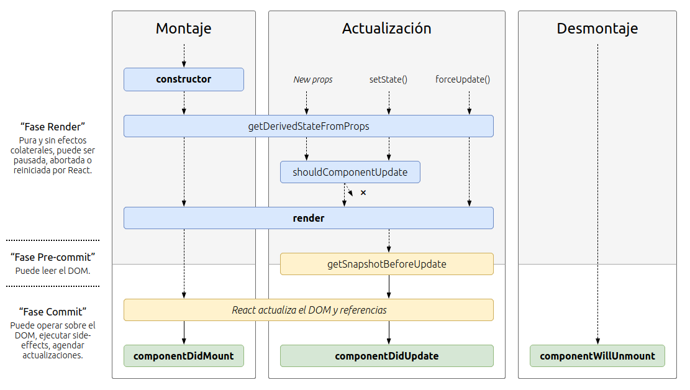
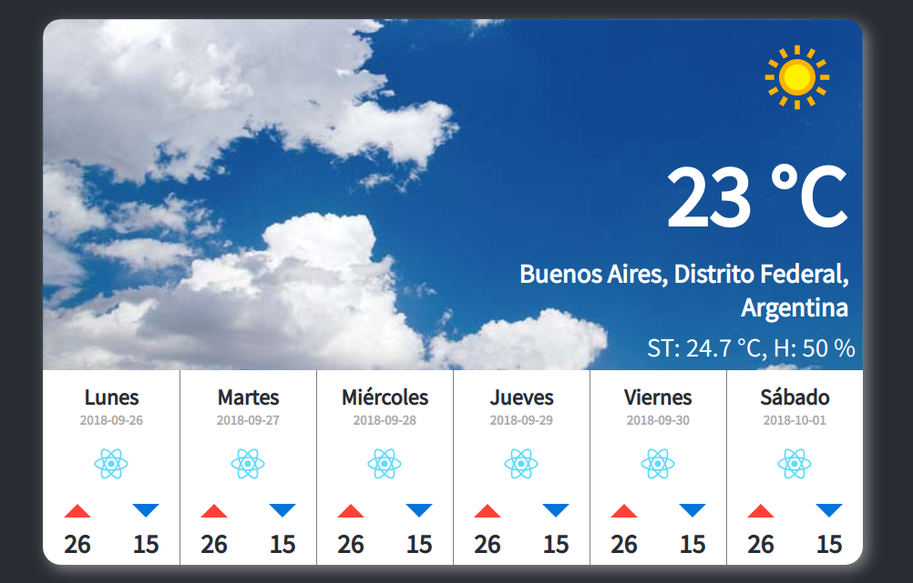

# Workshop de React

Buenísimo, ya tenemos una idea de cómo hacer los componentes de nuestra app del clima.
Vamos al archivo `templates/template.css` donde va a estar el css de la app ya preparado, lo abrimos y copiamos todo el contenido y lo pegamos en nuestro `src/App.css` ya existente. Hagamos lo mismo con el archivo `templates/template.js` y `src/App.js` donde ya van a estar preparadas las clases (`className` en React, recuerdan? ;P) con los estilos recién copiados.
Una vez que reemplazamos el código en nuestros archivos App.js y App.css vamos a generar una API key para poder utilizar el servicio de la API del clima de [Apixu](www.apixu.com), la página para registrarse es [esta](https://www.apixu.com/signup.aspx). Elegí Apixu porque me pareció una de las más simples en cuanto al registro y la velocidad en la que proveen la key, si les pregunta tipo de plan, obviamente pongan **FREE** ya que vamos a usarlo para cosas personales.

Bueno, repasamos antes de comenzar, deberíamos tener:

- Todo el código del archivo [`templates/template.css`](../templates/template.css) en nuestro -> `src/App.css`
- Todo el código del archivo [`templates/template.js`](../templates/template.js) en nuestro -> `src/App.js`
- Nuestra API Key de Apixu, la podemos ver en la página de Apixu en el [Dashboard](https://www.apixu.com/my/)

Una vez que hagamos eso, si todavía tenemos corriendo el servidor, deberíamos ver cómo se debería ver nuestra app terminada (falta componentizar todo, pequeño detalle). Si no lo vemos, es posible que haya que refrescar la página, sino es posible que no estemos corriendo el servidor, en cuyo caso debemos ir a la línea de comando y volver a ejecutar `npm start`.

## Empecemos - Consiguiendo nuestra data

Vamos a encarar esto primero consiguiendo los datos y teniéndolos a mano en el estado de nuestro componente para luego vamos a separar en componentes, pasando todos los datos (mediante **props**) que necesitemos pasar.
Hacer `API calls`, llamadas a las APIs, en React es quizás algo no tan simple como uno cree que debería ser, pero hay un post que lo explica bastante bien. Acá vamos a explicar lo necesario, pero si quieren ampliar pueden leer [el post acá (en inglés)](https://blog.hellojs.org/fetching-api-data-with-react-js-460fe8bbf8f2).

Antes de hacer el `fetch` para traer la data, tenemos que saber dónde pedirla 😝
Según la docu de Apixu, si le 'pegamos' a esta dirección, vamos a tener el pronóstico para el día de hoy + 6 días (sí, el día de hoy está incluido cuando hacemos `days=7`, está dos veces...)

`http://api.apixu.com/v1/forecast.json?key=<YOUR_API_KEY>&q=Buenos+Aires&days=6`

Donde dice `<YOUR_API_KEY>` ponemos nuestra key generada cuando nos registramos, y si vamos a esa dirección en el navegador (con nuestra key pegada) vamos a ver un JSON con toda la data que necesitamos (si se veo medio feo podemos copiar y pegar el texto del JSON en [JSON Formatter](https://jsonformatter.org) y va a quedar más claro cómo están compuestos los objetos, y en la [docu de apixu](https://www.apixu.com/doc/forecast.aspx) explica qué es cada parte del objeto, aunque vamos a ir viendo qué necesitamos para cada parte de nuestra app)

Y ahora la pregunta del millón: **dónde hacemos la llamada a la API en nuestro componente?**

Existe lo que se llama **"Métodos de los ciclos de vida"** (_Lifecycle methods_) de nuestros componentes, son parte de React y son para que podamos hacer distintas cosas en distintos momentos de la vida de nuestro componente.
En este diagrama podemos verlos bien y cuándo se ejecuta cada uno:


[Diagrama de Ciclos de vida de componentes](http://projects.wojtekmaj.pl/react-lifecycle-methods-diagram/)

El método donde vamos a hacer el fetch hacia la API de apixu es `componentDidMount()`, con la idea de que primero nuestro componente se monte (y renderice) correctamente y en ese momento buscar los datos para que se actualice el estado de nuestro componente causando que React lo re-renderice (no es algo que afecte a la performance, como dijimos, renderiza lo justo y necesario nomás).
Entonces, manos a la obra!

Esto es lo que vamos a hacer:

- Crear un estado en nuestro componente donde vamos a guardar los datos que vayamos a buscar a la API
- "Pegarle" a la API usando `fetch()` y guardando la respuesta en formato JSON en el estado
- Empezar a utilizar los datos de ese estado en el componente `App` que tenemos

Vamos a crear el estado (tal como vimos antes, se hace en el constructor del componente):

```jsx
[...]
class App extends Component {
  // Agregamos el constructor y definimos el estado
  constructor(props) {
    super(props);
    this.state = {
      clima: {}
    };
  }

  render() {
[...]
```

En `clima` vamos a guardar lo que traigamos de nuestra API para luego poder usar esa data. Vamos a hacer el `fetch()` a la dirección que obtuvimos antes, con nuestra API_KEY y como dijimos, va a ser adentro del método `componentDidMount()`:

```jsx
[...]
class App extends Component {
  constructor(props) {
      [...]
  }

  // Definimos el método componentDidMount con el fetch
  componentDidMount() {
    fetch(
      "http://api.apixu.com/v1/forecast.json?key=0df7569d7af3432a932170055XXXXXX&q=Buenos+Aires&days=6"
    )
      .then(response => response.json())
      .then(jsonData => {
        this.setState({ clima: jsonData });
      });
  }

  render() {
[...]
```

Vamos a analizar un poco lo que hicimos en el método, primero hicimos el [fetch](https://developer.mozilla.org/es/docs/Web/API/Fetch_API/Utilizando_Fetch) (el link es a la documentación para ampliar) y esto nos retorna un objeto Promise, es una promesa de la que vamos a obtener nuestros datos. Utilizando programación funcional con _function chaining_, podemos decir que `then` (entonces), una vez obtenida la `response` (respuesta), la retorne en formato JSON, usando el método `json()`. Luego siguiendo con la cadena de funciones, ese JSON va a caer en el siguiente `then` y lo recibimos en `jsonData`, actualizando luego el estado y guardando todo lo recibido en nuestro estado, en `clima`.
Ah, y no intenten usar esa key, no funciona 😜

Buenísimo, ya tenemos los datos el estado de nuestro componente, ahora nos falta empezar a usarlos!

Ya vimos más arriba qué recibimos en el JSON y un link a la docu de apixu para ver qué nos sirve, pero pasemos en limpio:

|         Nombre         |  Tipo  |                                                                     Para qué                                                                      |
| :--------------------: | :----: | :-----------------------------------------------------------------------------------------------------------------------------------------------: |
|       `location`       | objeto |                         Tiene datos de la locación que buscamos, tales como el nombre, país, región, latitud y longitud.                          |
|       `current`        | objeto | Tiene datos de la temperatura actual que buscamos, además de proveernos la imagen a mostrar del sol, nubes o lluvia dentro del objeto `condition` |
| `forecast.forecastday` | array  |                             Es un arreglo de objetos, cada objeto es un día y tiene algunos datos menos que `current`                             |

Así que, por lo que podemos ver, en la parte de arriba (el `div` con la clase 'top') vamos a usar más que nada datos de la parte de `current` y `location`.

Un **truquito** (ponele) para que no nos quede taaan largo nuestro código al usar los datos de nuestro estado (_this.state.clima.blablabla_ cada vez), podemos usar [_destructuring_](https://developer.mozilla.org/es/docs/Web/JavaScript/Referencia/Operadores/Destructuring_assignment) de ES6:

```jsx
const { location, current, forecast } = this.state.clima;
```

Esto debemos insertarlo en el `render()` de nuestro componente, antes del `return`. Luego podemos acceder a nuestra data por ejemplo haciendo `location.name`, `current.humidity`, etc.
Ya vimos cómo acceder a los datos que recibimos en el estado, así que les dejo un rato para ir acomodando toda la data en la parte de arriba de nuestro componente...
...
...
Listo? Ahhh te tira errores? `undefined` por todos lados? _Bienvenido/a a Javascript_ 🤣🤣 Nah, para evitar estas cosas existe algo súper útil que es el **conditional rendering** ([link a la docu](https://reactjs.org/docs/conditional-rendering.html)), donde le decimos que renderice cuando ya nuestra data esté "fetcheada" y disponible.
Esto lo logramos con un valor booleano (true o false) en el estado del componente que debemos alterar una vez que terminemos con el fetch.

Entonces agregamos en el estado `isLoaded: false` para indicar que todavía no está cargada nuestra data. Luego en el `fetch()` actualizamos nuestro estado e indicamos que ya junto con nuestra data cargada, cambiamos `isLoaded` a `true`: `this.setState({ clima: jsonData, isLoaded: true })`. Y luego al renderizar, retornamos según esté cargada o no nuestra data, verificando con el [operador ternario](https://developer.mozilla.org/es/docs/Web/JavaScript/Referencia/Operadores/Conditional_Operator) de la siguiente forma:

```jsx
render() {
  const { location, current, forecast } = this.state.clima;
    return this.state.isLoaded ? (
      {/* Nuestro componente */}
    ) : (
      <div className="App">
          Cargando...
      </div>
    )
```

Bueno, esto quizás es opcional pero me parece que queda mejor así. Vamos a usar una función de `String` para cambiar el tamaño de nuestra imagen del clima de arriba que queda medio chico en 64x64 (que es como lo recibimos desde la API). Si ven en `current.condition.icon`, hay un string con la URL de la imagen a mostrar (sol, nublado, lluvia, depende), para cambiar la resolución que figura ahí podemos manipular los datos recibidos con el `fetch()` antes de guardarlo en el estado.
Entonces hacemos lo siguiente:

```jsx
[...]
  componentDidMount() {
    fetch(
      "http://api.apixu.com/v1/forecast.json?key=0df7569d7af3432a932170055XXXXXX&q=Buenos+Aires&days=6"
    )
      .then(response => response.json())
      .then(jsonData => {
          //Manipulamos el string con la imagen para que sea de 128x128 y quede mejor
          jsonData.current.condition.icon = jsonData.current.condition.icon.replace(
          "64x64",
          "128x128"
        );
        this.setState({ clima: jsonData });
      });
  }
[...]
```

Usando `replace` le decimos que reemplace '64x64' por '128x128' en la URL recibida y listo, ya nos queda todo más lindo y más mejor.

Una vez que terminamos con la parte de arriba, debería quedarnos algo así nuestro `App.js`:

<details>
<summary>
<b>Click para ver</b>
</summary>

```jsx
import React, { Component } from "react";
import logo from "./logo.svg";
import "./App.css";

class App extends Component {
  constructor(props) {
    super(props);
    this.state = {
      clima: {},
      isLoaded: false
    };
  }

  componentDidMount() {
    fetch(
      "http://api.apixu.com/v1/forecast.json?key=0df7569d7af3432a932170055XXXXXX&q=Buenos+Aires&days=6"
    )
      .then(response => response.json())
      .then(jsonData => {
        jsonData.current.condition.icon = jsonData.current.condition.icon.replace(
          "64x64",
          "128x128"
        );
        this.setState({
          clima: jsonData,
          isLoaded: true
        });
      });
  }

  render() {
    const { location, current, forecast } = this.state.clima;
    return this.state.isLoaded ? (
      <div className="App">
        <div className="container">
          <div className="top">
            
            <p className="temp">{current.temp_c} °C</p>
            <h4 className="city">
              {location.name}, {location.region}, {location.country}
            </h4>
            <div className="feelslike">
              ST: {current.feelslike_c} °C, H: {current.humidity} %
            </div>
          </div>
          <div className="bottom">
            <div className="card">
              <h5>Lunes</h5>
              <h6>2018-09-26</h6>
              
              <div className="minmax">
                <p>
                  <span className="tempmax" />
                  26
                </p>
                <p>
                  <span className="tempmin" />
                  15
                </p>
              </div>
            </div>
            <div className="card">
              <h5>Martes</h5>
              <h6>2018-09-27</h6>
              
              <div className="minmax">
                <p>
                  <span className="tempmax" />
                  26
                </p>
                <p>
                  <span className="tempmin" />
                  15
                </p>
              </div>
            </div>
            <div className="card">
              <h5>Miércoles</h5>
              <h6>2018-09-28</h6>
              
              <div className="minmax">
                <p>
                  <span className="tempmax" />
                  26
                </p>
                <p>
                  <span className="tempmin" />
                  15
                </p>
              </div>
            </div>
            <div className="card">
              <h5>Jueves</h5>
              <h6>2018-09-29</h6>
              
              <div className="minmax">
                <p>
                  <span className="tempmax" />
                  26
                </p>
                <p>
                  <span className="tempmin" />
                  15
                </p>
              </div>
            </div>
            <div className="card">
              <h5>Viernes</h5>
              <h6>2018-09-30</h6>
              
              <div className="minmax">
                <p>
                  <span className="tempmax" />
                  26
                </p>
                <p>
                  <span className="tempmin" />
                  15
                </p>
              </div>
            </div>
            <div className="card">
              <h5>Sábado</h5>
              <h6>2018-10-01</h6>
              
              <div className="minmax">
                <p>
                  <span className="tempmax" />
                  26
                </p>
                <p>
                  <span className="tempmin" />
                  15
                </p>
              </div>
            </div>
          </div>
        </div>
      </div>
    ) : (
      <div className="App">Cargando...</div>
    );
  }
}

export default App;
```

</details>

--

Lo tenés igual? Parecido? Bueno, si ves que te trabaste con algo o no te sale, podés copiar y pegar o leer el código por algún _gotcha_ de algo que no te esté saliendo 😁

Listo, ya tenemos la parte de arriba andando **perfectamente** y ahora vamos a atacar la parte de abajo. Analicémosla un poco antes...



La idea de React y los componentes es tener partes reutilizables de código, entonces, qué vemos que se repite y pueda reutilizarse en nuestro componente? Eso que se repite podemos separarlo en un componente aparte. Ya lo identificaste?

[⭠ Volver a Props y State](PropsState.md)

[Vamos al siguiente paso entonces! ⭢](Workshop2.md)
